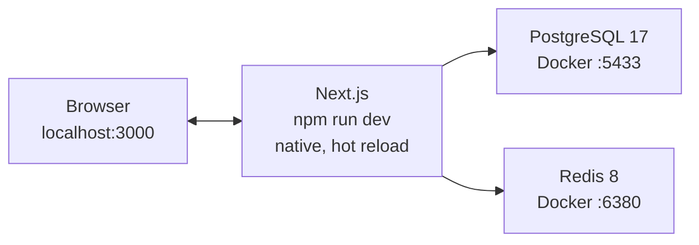

# Local development

Day-to-day commands and workflows. For what the pieces _are_, see
[CONCEPTS.md](CONCEPTS.md). For when something breaks, see
[TROUBLESHOOTING.md](TROUBLESHOOTING.md).

## First time on a new machine

```bash
npm install
npm run setup     # writes .env.local with freshly generated secrets
npm run dev:up    # starts PostgreSQL and Redis in Docker
npm run doctor    # verifies all of the above
npm run dev
```

`npm run setup` will not overwrite an existing `.env.local`. Pass `--force` if you
really mean to replace it; it keeps a `.env.local.backup`.

Then create yourself an account. There is no sign-up page, so the first one is made
from the terminal:

```bash
npm run db:migrate        # create the tables
npm run db:seed           # fill the ten taxonomy lists
npm run auth:create-owner # asks for a name, email and password
```

`db:seed` puts the 389 starting values - statuses, platforms, fabrics, the 165
sub-categories, the 122 tags - into the taxonomy tables. It only ever inserts what
is missing, so running it again after you have edited a list on the Taxonomy page
changes nothing. It prints what it inserted and what was already there.

If you want something on the charts before the first real enquiry arrives, invent
some:

```bash
npm run db:demo             # ~140 leads over the last 90 days
npm run db:demo -- 400      # more of them
npm run db:demo -- clear    # remove every invented row again
```

Every row it writes is named `[demo]`, which is how `clear` finds its own and nothing
else. It refuses to run when `APP_ENV=production`.

Sign in at http://localhost:3000, and you will be asked to set up an authenticator
app straight away - two-factor is required for every account, including yours. Any
TOTP app works: Google Authenticator, 1Password, Bitwarden. Keep the backup codes it
shows you; they are the only way back in if you lose the phone.

Everyone else is added from the Team page, which produces a one-time link to send them.

## Every day

```bash
npm run dev:up    # only if Docker was restarted; harmless to run anyway
npm run dev       # http://localhost:3000
```

Leave `npm run dev` running. Saved changes appear in the browser immediately.

When you are finished for the day, `npm run dev:down` stops the containers and
keeps your data. You can also just leave them running - they use very little when
idle, and Docker Desktop restarts them automatically.

## What runs where



The app itself is **not** in Docker during development, so hot reload stays fast.
Only the database and cache are containerised, so that you never have to install
or configure them, and so your local versions match the server.

Ports are deliberately non-default: PostgreSQL on **5433**, Redis on **6380**.
Laragon's MySQL and any future default install cannot collide with them.

## Container commands

| Command               | Effect                                                         |
| --------------------- | -------------------------------------------------------------- |
| `npm run dev:up`      | Start PostgreSQL and Redis in the background                   |
| `npm run dev:status`  | Show whether they are running and healthy                      |
| `npm run dev:logs`    | Follow their logs; `Ctrl+C` to stop watching                   |
| `npm run dev:down`    | Stop them, **keeping** all data                                |
| `npm run dev:destroy` | Stop them and **delete all local data permanently**            |
| `npm run dev:reset`   | Destroy, recreate, and wait until the database accepts queries |

`dev:destroy` and `dev:reset` erase your local database. That is often exactly what
you want - a clean slate is one command away - but nothing warns you first.

## Checking your work

```bash
npm run verify
```

That runs four things, and it is what CI runs too:

| Step                   | Catches                                          |
| ---------------------- | ------------------------------------------------ |
| `npm run typecheck`    | Type errors: wrong shapes, renamed columns       |
| `npm run lint`         | Bugs and rule violations, e.g. a missing `await` |
| `npm run format:check` | Formatting drift                                 |
| `npm run test`         | Broken logic                                     |

Individually useful:

```bash
npm run test:watch    # re-runs affected tests as you type
npm run lint:fix      # fixes what can be fixed automatically
npm run format        # reformats everything
```

### Probes

Two checks need a running database, so they are scripts rather than tests -
`npm run verify` has to pass on a machine with nothing started.

```bash
npm run auth:probe   # sign-in, two-factor, backup codes, invitations
```

`auth:probe` creates a throwaway account, walks the entire authentication flow
against the real database, and deletes everything it made. It is worth running after
any change to authentication, roles, or the invitation flow. Start `npm run dev` first
and it will also check the invitation page renders.

The output is a list of `ok` lines and a final count. Anything marked `FAIL` is a real
finding, not a flaky test.

## The n8n intake

Enquiries arrive as social media messages; n8n forwards them to `POST /n8n/intake`,
where they land in a staging table and wait for a person at `/intake`. Nothing becomes
a lead without someone confirming it. `docs/CONCEPTS.md` explains why; this is how to
run it.

### Sending a test message without n8n

```bash
npm run intake:simulate -- "Do you have batik frocks in size L?"
```

Signs and posts one message using `N8N_WEBHOOK_SECRET` from `.env.local`. Expect
`201 {"id":"...","status":"pending"}`, then open `/intake` and the message is waiting.
Use this before blaming n8n for anything - it isolates the endpoint from the workflow.

### Pointing n8n at it

**Authentication is a shared secret**, `N8N_WEBHOOK_SECRET`. There is no username or
password and no session; n8n is not a person who signs in.

1. In n8n: **Credentials → Add credential → Header Auth**.
   - Name: `Authorization`
   - Value: `Bearer <the value of N8N_WEBHOOK_SECRET from .env.local>`
2. Import `docs/n8n-intake-workflow.json` (**Workflow menu → Import from File**). Two
   nodes: a manual trigger and an HTTP Request.
3. On the HTTP Request node, select the credential from step 1.
4. **Execute workflow.** Expect `201`, then check `/intake`.

The URL differs by where n8n runs:

| n8n is                     | URL                                           |
| -------------------------- | --------------------------------------------- |
| in Docker, app on host     | `http://host.docker.internal:3000/n8n/intake` |
| on the same VPS as the app | `http://<app-container-name>:3000/n8n/intake` |

`host.docker.internal` is how a container reaches the machine hosting it. A container
that calls `localhost` is calling _itself_, which is the first thing to check when
nothing arrives.

### Production

Nothing extra. Create the same Header Auth credential in the production n8n, set
`N8N_WEBHOOK_SECRET` in the app's environment to the same value, and point the URL at
the app over the internal Docker network. No container rebuild and no custom flags -
that is the whole reason the endpoint accepts a bearer token and not only a signature.

Keep the endpoint off the public internet: the reverse proxy must not forward `/n8n/*`.

## Git hooks

Installed automatically by `npm install`.

**On commit:** staged files are scanned for credentials, then formatted and linted.
The secret scan blocks the commit if it finds anything, because a secret that
reaches history is compromised permanently - removing it later does not help, since
the value was already pushed and cached. If it flags something that genuinely is
not a secret, add a comment containing `secret-scan:allow` on that line.

**On push:** typecheck and tests run. `git push --no-verify` skips this, for
emergencies only.

## Logs

Application logs are structured JSON, one object per line, so they can be searched
and filtered on the server. For readable output locally:

```bash
npm run dev:pretty
```

The logger redacts fields named like credentials (`password`, `token`, `secret`,
`cookie`, and similar) anywhere in a logged object. Do not rely on that alone -
never deliberately log a secret or a full phone number.

## Testing a production build locally

```bash
npm run build
npm start
```

This works against `http://localhost` because `APP_ENV` stays `development` even
though `NODE_ENV` becomes `production` during a build. See the configuration
section of [CONCEPTS.md](CONCEPTS.md) for why those are two separate variables.

## Adding a dependency

```bash
npm install <package>          # needed at runtime
npm install -D <package>       # only needed while developing or building
```

Then run `npm audit`. The project is currently at zero known vulnerabilities, and
it is worth keeping it there. One `overrides` entry already exists in
`package.json`, pinning a nested `esbuild` up to a patched version so that
`drizzle-kit` does not drag in a vulnerable copy.

## Editing configuration

Add the variable to **three** places, or startup will reject it:

1. `.env.example` - documented placeholder, committed
2. `.env.local` - your real value, never committed
3. `src/lib/env/schema.ts` - the validation rule

Then import it as `env.YOUR_VARIABLE` from `@/lib/env`. Reading `process.env`
directly is blocked by ESLint.
