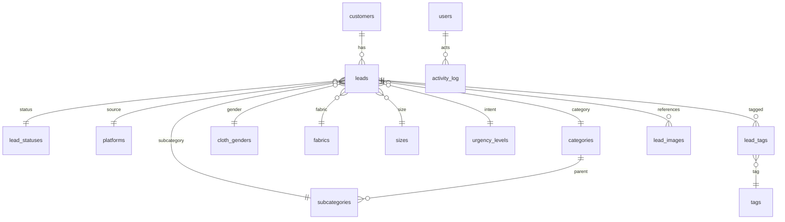

<!--
  Provenance note (added when this was filed, not part of the original document):

  This is the plan Hashi and Cursor produced before the project moved to Claude
  Code - the proposal that got this repository started, kept here verbatim
  because most of it is still true and explains WHY things are built the way
  they are, not just what they are.

  Fenced as one block below rather than left as ordinary markdown: Prettier's
  markdown formatter reflows YAML frontmatter and nested lists in ways that
  would quietly drift this file from what was actually written, which defeats
  the point of an archival copy. The fence is what keeps `npm run format`
  honest without editing the source.

  It is a snapshot from before Phase 0 wrote a line of code, not a status
  report. `docs/HANDOVER.md` is the living source of truth for what actually
  exists today; where the two disagree, HANDOVER.md and the code win. Known
  divergences, so nobody has to diff the two documents by hand:

  - **Public website**: this plan explicitly parked it ("designed for but
    deliberately out of scope now"). It is now in scope - see HANDOVER.md.
  - **n8n integration**: this plan specified HMAC-only. The shipped version
    also accepts a bearer token, because n8n's Code node needs
    `NODE_FUNCTION_ALLOW_BUILTIN=crypto` to compute an HMAC, which is not a
    workable requirement for a solo operator on a managed n8n. HMAC is still
    supported and still wins when both are sent - see HANDOVER.md and
    CONCEPTS.md, "Automated intake from n8n".
  - **Data grid**: this plan named TanStack Table, nuqs and cmdk specifically.
    The shipped leads/customers/activity lists instead read and write filter
    state directly against the URL with small feature-local modules
    (`features/leads/filters.ts` and siblings) and plain server-rendered
    tables - same goal (server-paginated, filterable, bookmarkable, no client
    fetch), no extra dependency.
  - **Deployment**: this plan's GHCR-build → SSH-pull → separate locked
    migration step is exactly what got built - see `Dockerfile`,
    `docker/compose.prod.yml` and `docs/DEPLOYMENT.md`.
  - **Money, stock, orders**: still out of scope, same as this plan describes.
  - Smaller specifics - exact image sizes generated, exact table/column names,
    exact library versions - may have shifted during actual implementation.
    Trust the code over this document for anything at that level of detail.
-->

````text
---
name: Ceylon Collection Backend
overview: Build a production-grade Ceylon Collection lead-intelligence back office as a single Next.js 16 full-stack app (Server Actions + Drizzle + PostgreSQL 17 + Redis), developed and testable locally on Windows via Docker Desktop, version-controlled on GitHub, deployed by Docker Compose onto your existing Contabo VPS alongside n8n (which becomes the social-media lead intake and follow-up automation layer), with a locked design system from your palette PDF and reference HTML plus brand imagery generated through Higgsfield.
todos:
  - id: phase0-foundation
    content: "Phase 0: scaffold Next.js 16 + TypeScript strict + Tailwind 4 repo, reference/ and docs/ folders, local Docker dev stack (Postgres 17 + Redis) with npm run dev on host, Zod-validated env loader, pino logger, ESLint/Prettier/Husky/gitleaks, Vitest + Playwright harness, private GitHub repo with CI"
    status: pending
  - id: phase0b-guidance
    content: "Phase 0b: guidance layer - npm script wrappers for every Docker command (dev:up/down/logs/reset, db:studio, deploy, deploy:rollback), npm run doctor preflight that checks Node/Docker/ports/env/DB and prints specific fixes, and docs/CONCEPTS.md mapping Laravel-MySQL knowledge onto this stack plus GLOSSARY.md and TROUBLESHOOTING.md"
    status: pending
  - id: phase1-design-system
    content: "Phase 1: implement theme tokens (public / admin-dark / admin-light) with cookie-based SSR theme switching, typography scale, UI primitives (Button, Input, Combobox, MultiSelectPills, Sheet, Badge, DataTable shell), admin layout shell with sidebar/topbar/breadcrumbs, and DESIGN-SYSTEM.md"
    status: pending
  - id: phase1b-brand-assets
    content: "Phase 1b: generate brand assets via Higgsfield CLI (gpt_image_2 for the CC monogram, favicon set, empty-state and error-page art; nano banana pro for the login handloom/batik texture), post-process to WebP/AVIF with sharp, and record every prompt in docs/ASSETS.md for reproducibility"
    status: pending
  - id: phase2-auth-rbac
    content: "Phase 2: Better Auth with Drizzle adapter, invite-only accounts, TOTP 2FA, DB sessions, roles/permissions and requireAuth guard, activity_log audit trail, security headers + CSP nonces, Redis rate limiting"
    status: pending
  - id: phase3-taxonomy
    content: "Phase 3: ten taxonomy tables with migrations, full seed data (statuses, platforms, genders, sizes, cities, urgency with is_ready_to_buy, fabrics, categories, ~170 subcategories, ~180 grouped tags), and admin CRUD screens with reference-protected deletes"
    status: pending
  - id: phase4-leads-customers
    content: "Phase 4: customers + leads schema with E.164 phone normalization, lead create/edit form with searchable selects and tag pills, leads DataTable with server pagination/filters/saved views/export, customer_summary SQL view and customers page with action rules engine, CSV importer with dry-run preview"
    status: pending
  - id: phase4b-lead-images
    content: "Phase 4b: lead reference images - lead_images table with sha256 dedupe, storage adapter (local volume now, S3/R2 later), magic-byte type sniffing with SVG rejected, sharp re-encode stripping EXIF/GPS plus 240/1280/original sizes, authenticated streaming route, drag-drop + clipboard-paste + camera uploader with reorder/primary/caption/lightbox, thumbnail column in leads table, upload rate limits and audit logging, restic image backups"
    status: pending
  - id: phase5-analytics
    content: "Phase 5: analytics dashboard with global filter bar, Chart.js brand-themed wrappers, leads-over-time, status funnel with conversion, new-vs-repeat, Top-N bars with Other bucket for category/subcategory/fabric/size/city, gender and platform splits, accessible table fallbacks"
    status: pending
  - id: phase6-n8n-integration
    content: "Phase 6: n8n automation layer - lead_intake staging table with HMAC-signed internal-only ingest endpoint, admin review/approve queue, signed read-only follow-up and digest endpoints, and n8n workflows for social lead capture, daily owner digest and health monitoring"
    status: pending
  - id: phase7-harden-deploy
    content: "Phase 7: performance pass (indexes, query plans, caching), accessibility and responsive audit at 375/768/1024/1440 in both themes, encrypted offsite backups with tested restore, Sentry, Contabo VPS hardening, deploy behind the existing reverse proxy via GHCR image pull"
    status: pending
isProject: false
---

« # Ceylon Collection — Lead Intelligence Back Office

## Decisions I made for you (and why)

**Architecture: one Next.js 16 full-stack app. Drop Laravel.**
Your instinct to use Laravel is reasonable, but for this specific product it costs you and buys little. You would run two runtimes, two deploys, a cross-origin cookie/CSRF setup, and duplicate every field twice (Eloquent model + validation in PHP, then TypeScript type + form schema in React) — and you would *still* hand-build the entire admin UI in React. A single app gives you:

- **No browser-facing API.** Every mutation is a Server Action that runs on the server; the database is only reachable from the app container over the Docker network. There is no JSON API to enumerate, no bearer token in the browser, no CORS policy to get wrong. This is the strongest possible answer to "no security holes for a data breach". (The one exception is a tiny n8n integration surface — see the n8n section; it is bound to the internal Docker network and never published through the reverse proxy.)
- One language, one schema, one deploy, end-to-end types from column to `<input>`.
- Total design control, so the reference HTML translates 1:1 instead of fighting an opinionated admin framework.

Laravel + Filament would have been my pick if you wanted an admin *tomorrow* with zero UI work, but it cannot deliver the custom analytics surface and brand-exact UI you described.

**Payload CMS: rejected.** No official MySQL adapter exists (Postgres/Mongo/SQLite only), and its opinionated admin panel would be fought, not used, for this analytics-heavy workload.

**Database: PostgreSQL 17, not MySQL.** Your VPS makes this free to choose, and the entire product is aggregation queries: top-N demand, repeat-customer detection, funnel conversion, time series. Postgres gives `FILTER`, window functions, lateral joins, `GIN` indexes for tag arrays and trigram search on names — all of which MySQL either lacks or does badly. You write SQL through Drizzle, so it stays familiar. (Note: Postgres is impossible on your Business Web Hosting plan — VPS only.)

**Host: your existing Contabo VPS**, not Hostinger Business Web Hosting (whose Node.js apps are idle-stopped and cold-started per request and cannot run Postgres, Redis or workers). Contabo is a better fit anyway — generous RAM and disk for the price, and n8n is already there, which turns a constraint into a feature. Keep Hostinger for the domain, DNS and email.

**Brand name: use "Ceylon Collection", not "Ceylon Clothing".** Your palette PDF, reference HTML and project folder already say Collection, and it is the better name: your categories already include Accessories and Footwear, which "Clothing" excludes, and "Collection" honestly describes a curated import business rather than implying you manufacture. Confirm and I will lock it everywhere.

## Stack (versions verified live)

- Next.js `16.3.0` (App Router, Server Actions, standalone output) + React `19.2.8`
- Tailwind CSS `4.3.3` with `@theme` design tokens
- Drizzle ORM `0.45.2` / drizzle-kit `0.31.10`, driver `postgres@3.4.9`
- Better Auth `1.6.27` (DB sessions, TOTP 2FA, invite-only, Drizzle adapter)
- Zod `4.4.3` for every input boundary; TanStack Table `9.1.2` for data grids
- Chart.js `4.5.1` + react-chartjs-2 `5.3.1` (as you asked)
- cmdk `1.1.1` + Radix Popover for searchable dropdowns and tag pills
- ioredis `6.0.0` (sessions cache, rate limits, cached aggregates), libphonenumber-js `1.13.10`, pino `10.3.1`, Sentry `10.70.0`, nuqs `2.9.5` (filter state in URL)

Environment quirk found: npm here fails TLS verification unless `NODE_OPTIONS=--use-system-ca` is set. Recorded in the runbook.

## Repository layout

```
ceyloncollection/
  reference/                     # untouched source material + notes
    public-website.html
    Ceylon_Collection_Theme_Palette_Suggestion.pdf
    DESIGN-NOTES.md
  docs/  ARCHITECTURE.md SECURITY.md DATA-MODEL.md DESIGN-SYSTEM.md
         ASSETS.md N8N.md LOCAL-DEV.md DEPLOY.md RUNBOOK.md
         CONCEPTS.md GLOSSARY.md TROUBLESHOOTING.md
  docker/  Dockerfile  compose.yml  compose.dev.yml
  .github/workflows/  ci.yml  deploy.yml
  n8n/                           # exported workflow JSON, version-controlled
  scripts/  seed-demo.ts  generate-assets.ps1  backup.sh  restore.sh
  e2e/                           # Playwright specs
  public/brand/                  # generated logo, favicons, illustrations
  src/
    app/
      (public)/                  # routes reserved, not built yet
      (auth)/login  two-factor  invite
      (admin)/admin/
        dashboard  leads  customers  intake  analytics  settings  users
      api/health
      api/integrations/n8n/      # internal-network only, HMAC signed
    components/ui/               # Button, Input, Combobox, MultiSelectPills, Sheet, Table…
    components/charts/           # typed Chart.js wrappers, brand-themed
    features/{leads,customers,taxonomy,analytics,auth,intake}/
      actions.ts queries.ts schemas.ts columns.tsx
    db/{schema,migrations,views,seed}/
    lib/{auth,rbac,audit,env,rate-limit,logger,phone,export,hmac,storage,images}/
    styles/theme.css   theme/tokens.ts
```

Feature-first, Server Actions colocated with the Zod schema and query layer they serve.

## Data model



**`customers`** — surrogate `id` primary key with `phone_e164` as a `UNIQUE NOT NULL` business key. You asked for phone as the primary key; a mutable text PK propagates into every foreign key and breaks the day a customer changes number, so the unique constraint gives you the same guarantee (one customer per phone, enforced by the database) without that risk. Phones normalise to E.164 via libphonenumber-js on write (`+974…`, `+94…`) with `phone_raw` kept for display, so `50123456`, `+974 5012 3456` and `0097450123456` can never become three customers. Plus `whatsapp_e164`, `name`, `city_id`, `primary_platform_id`, `notes`, `marketing_consent_at`, `is_blocked`, timestamps.

**`leads`** — one row per product request, matching your spreadsheet exactly: `lead_no` (human-readable `CC-2026-0001`), `customer_id`, `inquiry_date`, `platform_id`, `category_id`, `subcategory_id`, `cloth_gender_id`, `fabric_id`, `size_id`, `qty_requested`, `urgency_id`, `status_id`, `notes`, `created_by`, `updated_by`, soft delete, timestamps. Tags via a `lead_tags` junction.

**`lead_images`** — up to five reference photos per lead, which matters because most of your inquiries will arrive as "I want something like this" with a photo attached. Columns: `lead_id` (cascade delete), `storage_key`, `original_filename` (metadata only, never used as a path), `mime`, `byte_size`, `width`, `height`, `sha256`, `caption`, `sort_order`, `is_primary`, `uploaded_by`, timestamps, soft delete. The `sha256` checksum de-duplicates, so the same photo forwarded twice does not get stored twice.

Three sizes are generated at upload time with `sharp` — a 240px thumbnail for the table, a 1280px display version for the gallery, and the cleaned original — so nothing is resized at request time. Storage goes through a small adapter interface writing to a Docker volume on the VPS by default, meaning a later move to S3, Cloudflare R2 or Contabo Object Storage is a config change rather than a rewrite. Files live outside the web root and are **never served statically**: every view goes through an authenticated route handler that checks the session and permission first, so a leaked URL is worthless to someone who is not logged in.

**Ten taxonomy tables, all admin-editable** (`lead_statuses`, `platforms`, `cloth_genders`, `sizes`, `cities`, `urgency_levels`, `fabrics`, `categories`, `subcategories`, `tags`) each with `name`, `slug`, `sort_order`, `is_active`, `color` where useful, and delete protection that blocks removal of any value already referenced by a lead (offering deactivate instead). Seeded with every value you supplied: 10 statuses, 9 platforms, 6 genders, 17 sizes, 13 Qatar cities, 5 urgency levels, 24 fabrics, 18 categories, ~170 subcategories, ~180 tags.

Two seed details that make the UI work rather than just storing your lists:
- `urgency_levels.is_ready_to_buy` boolean — this is what powers your "Ready to Buy Requests" count, instead of hardcoding a string match.
- `tags.tag_group` — 180 flat tags in one dropdown is unusable, so they seed into the eight groups your own list is already ordered by: Print & Craft, Silhouette & Fit, Length, Neckline, Sleeve, Occasion, Details & Features, Origin & Sizing. `sizes.size_group` (Adult / Kids / Other) does the same job for the size picker.

**Every derived column you listed is computed in SQL, never stored.** Stored counters drift and go stale; a `customer_summary` view is always correct and, at your data volume, instant. Derived: `requests_by_customer`, `customer_type` (Repeat/New), `days_since_contact`, `sub_cat_demand`, `first_contact`, `last_contact`, `latest_status`, `last_interest`, `ready_to_buy_requests`. This also matters because VPS or not, no cron job is needed to keep them true.

**`action`** (HOT LEAD / FOLLOW UP / Monitor / Shipped / Delivered / Lost) is a rules engine over status + urgency + recency + repeat count, with every threshold stored in a `settings` table so you tune it in the UI instead of asking me to redeploy.

**Supporting tables:** `users` / `sessions` / `verifications` (Better Auth), `roles` + `permissions` (owner, admin, staff, viewer), `activity_log` (actor, entity, action, before/after JSONB, IP, user agent), `settings`, `saved_views`.

Migrations are versioned SQL via drizzle-kit — never `db push` against production.

## Admin features in this build

- **Leads**: server-paginated TanStack Table, per-column filters, multi-sort, column visibility, density toggle, saved views, row detail sheet, inline status change, bulk actions, CSV/XLSX export. Filter state lives in the URL via nuqs so any view is shareable and bookmarkable.
- **Create/edit lead**: single form where every dropdown is a searchable combobox, tags are grouped searchable pills, subcategory options filter to the chosen category, and typing a known phone number auto-fills the existing customer and shows their history inline.
- **Reference photos**: up to five images per lead via drag-and-drop, file picker, phone camera, **and paste straight from the clipboard** — that last one is the important one, because your real workflow is copying a photo out of WhatsApp Web and dropping it into the lead, and anything slower than Ctrl+V will not get used. Thumbnail grid with reorder, set-primary, optional caption, lightbox viewer, and delete with confirmation. Large photos are downscaled in the browser before upload so a 12MP phone picture does not cost you bandwidth. The leads table gets a small primary-image thumbnail column, and the customer timeline shows past photos, so you can see at a glance what someone has been asking for.
- **Customers**: the derived view with all your columns, drill-through to that customer's leads timeline, WhatsApp deep link (`wa.me`), and an Action badge from the rules engine.
- **Analytics**: global date-range + filter bar driving leads-over-time (day/week/month), status funnel with conversion rates, New vs Repeat over time, and Top-N bars for category, subcategory, fabric, size and city with a 5/10/20 selector plus an "Other" bucket — your point about thousands of subcategory combinations is exactly why Top-N with an explicit remainder bucket is the only honest way to chart it. Doughnuts for gender and platform split. Every chart has an accessible data-table fallback.
- **Settings**: CRUD for all ten taxonomies, scoring thresholds, brand config.
- **CSV importer** for the spreadsheet you already keep: upload, column mapping, row-level validation, dry-run diff preview, then commit — so day one starts with your real history, not an empty database.
- **Users**: invite-only accounts, roles, forced TOTP enrolment, session revocation, audit trail viewer.

## Design system (locked before any UI is written)

Tokens live in `src/theme/tokens.ts` and `src/styles/theme.css` as three palettes — `public`, `admin-dark` (default), `admin-light` — swapped by a `data-theme` attribute on `<html>`, persisted in a cookie and read during SSR so there is no flash. Changing the entire brand later means editing one file.

Type scale from your reference HTML, with one deliberate change for the admin: Marcellus for labels, buttons and section headings; Jost for all body and table content with tabular numerals; Cormorant Garamond reserved for the login screen, the dashboard greeting and the public site. A display serif in dense data tables reads badly, and your own PDF says the backend should "stay clean, readable and operational".

I computed the contrast ratios, and two rules fall out that prevent the inconsistency you are worried about:

- Gold `#B77A17` on ivory `#FAF7F2` is only **3.38:1** — it fails WCAG AA for normal text. Your reference HTML uses it for `.eyebrow` at `0.72rem`, which is a real accessibility bug. So gold is allowed for large display text, icons, borders, rules and hover accents only, and a paired `--gold-ink: #8A5C11` (**5.43:1**, passing) is used for small text and links on light surfaces.
- On dark, gold `#D2A34A` reads **6.53:1** on card `#1A2738`, and gold buttons take navy `#142B49` text (**6.17:1**) — never white.

Verified passing: muted taupe on ivory 4.69:1, dark secondary text on card 7.12:1, light primary button 13.4:1.

Standards enforced from your `ui-ux-pro-max` checklist: 44px minimum touch targets, visible focus rings (gold on dark, navy on light), SVG icons only from a single set (Lucide) with no emoji, `cursor-pointer` on everything clickable, 150–300ms transitions on colour and opacity only (never layout-shifting scale), `prefers-reduced-motion` honoured, skeletons sized to reserve space, and a documented z-index scale. Verified at 375 / 768 / 1024 / 1440 in both themes.

Note on the `ui-ux-pro-max` skill: its files are present after all (my earlier "folder is empty" reading was the sandbox hiding directory listings). Its `--design-system` generator does crash on your Python 3.10 — `scripts/design_system.py:437` puts a backslash inside an f-string expression, which needs Python 3.12+ — so the rule checklist inlined in the skill was applied by hand instead. That is no real loss here, because your palette PDF and reference HTML already fix the colours and fonts that the generator would have suggested. Say the word and I will fix that one line so the tool works for future projects.

Your reference HTML is preserved untouched in `reference/`. Its *design* is the source of truth; its *copy* is not — it currently says Colombo, island-wide delivery and LKR pricing, all of which must become Qatar, QAR and WhatsApp-first when the public site is built for Sri Lankans living in Qatar.

## Security posture

- Deny-by-default authorization: every Server Action begins with `requireAuth(permission)` then a Zod parse. No action trusts a client-supplied id without an ownership/role check.
- Better Auth DB-backed sessions; httpOnly + Secure + SameSite=Lax cookies, rotation on privilege change, idle and absolute timeouts, revoke-all. No public signup — invite only. TOTP 2FA mandatory for owner and admin.
- Strict CSP with per-request nonces (no `unsafe-inline`), HSTS with preload, `frame-ancestors 'none'`, Referrer-Policy, Permissions-Policy, COOP/CORP. Server Action origin allow-list.
- Redis-backed rate limits on login, password reset and export, plus reverse-proxy request limits and fail2ban.
- Drizzle parameterised queries only; raw analytics SQL uses bound `sql` templates. React escaping everywhere, no `dangerouslySetInnerHTML`.
- `lib/env` validates every environment variable with Zod at boot and refuses to start if one is missing or malformed.
- **File uploads get the strictest treatment in the app, because they deserve it.** Accepted types are decided by sniffing magic bytes, never by the file extension or the browser's `Content-Type`: JPEG, PNG, WebP and HEIC only — HEIC explicitly included because iPhone customers will send it. **SVG is rejected outright**, since it is executable XML and a direct XSS vector. Every accepted file is then **fully re-encoded through `sharp`**, which is the single most valuable step here: it destroys any payload hidden in a polyglot or malformed image, and it strips EXIF — including the **GPS coordinates** that phone photos routinely carry, which you do not want sitting in your database attached to a customer. Also enforced: five files per lead, 10 MB each, `limitInputPixels` against decompression bombs, random UUID storage keys (the user's filename never touches the filesystem), a directory outside the web root with no execute permission, per-user upload rate limits, `X-Content-Type-Options: nosniff` with a `Content-Type` we determined ourselves, and an audit-log entry for every upload, view and delete. A ClamAV sidecar is available if you ever want scanning on top, though re-encoding already handles the realistic threats.
- Postgres reachable only on the Docker network via a least-privilege role — never published to the host. Nightly encrypted `pg_dump` shipped offsite, with a documented and *tested* restore. **The uploaded images are backed up too**, on their own schedule with `restic` — a database-only backup would restore your leads with every photo missing, which is a mistake worth avoiding before it happens rather than after.
- Phone numbers are personal data under Qatar's PDPPL (Law 13 of 2016), so: role-gated visibility with masking for lower roles, every read-export written to the audit log, re-authentication required for bulk export, explicit marketing-consent field, and a retention policy. Field-level encryption is deliberately not used because it would destroy the uniqueness constraint and search that the whole model depends on.
- Audit log on every write, login, permission change and export.
- **The n8n integration surface is treated as untrusted.** It listens only on the internal Docker network (never proxied to the public internet), requires an HMAC-SHA256 signature over the raw body with a rotating shared secret, rejects requests whose timestamp is more than 60 seconds old, de-duplicates by idempotency key, is rate-limited, and can only write to a quarantined `lead_intake` staging table — never to `leads` or `customers` directly. A compromised n8n workflow can therefore create noise for you to reject, not corrupt your data.
- VPS baseline: SSH keys only, root login disabled, UFW limited to 22/80/443, fail2ban, unattended-upgrades, Docker daemon not exposed, Sentry plus pino structured logs plus an uptime check.

## Working with a stack that is new to you

You told me you know MySQL, PHP and Laravel but not Docker, Postgres or Redis. Here is the honest picture, because it is better than you probably expect in two places and worse in one.

**Docker actually reduces what you have to learn, not increases it.** It is not a thing you administer here — it is how you avoid administering Postgres and Redis by hand. Installing and configuring Postgres on Windows, then again on the VPS, then keeping the two versions in sync, is a genuinely annoying afternoon each time. With Docker it is `npm run dev:up` and both are running, configured identically to production. Think of it as Laragon: you never learned to configure Apache and MySQL by hand either, because Laragon did it. Docker is that, for this stack.

**Redis is not something you will interact with at all.** It sits behind the rate limiter and the session cache. You will never write a Redis command. And I am building the `DISABLE_REDIS=true` flag anyway, so if it ever gets in your way locally you switch it off and the app keeps working.

**Postgres will feel familiar faster than you expect.** It is still SQL, still tables and joins and indexes. Drizzle Studio gives you a browser UI for looking at and editing rows, which is your phpMyAdmin. The handful of real differences that will actually bite you — `SERIAL`/identity instead of `AUTO_INCREMENT`, double quotes for identifiers instead of backticks, `ILIKE` for case-insensitive matching, stricter `GROUP BY` — go in `docs/CONCEPTS.md` with the MySQL equivalent beside each.

**The genuinely new thing is TypeScript and React, not the infrastructure.** I want to be straight with you about that rather than let you discover it in week three. Server Actions will feel reasonable coming from Laravel controllers, and Drizzle will feel reasonable coming from Eloquent, but JSX and React state are a real shift from Blade. Every option that gives you the Next.js admin you asked for has this same cost — the only way to avoid it entirely would be a PHP-rendered admin, which is the trade I raised earlier.

So `docs/CONCEPTS.md` maps what you already know onto what this uses:
- Laragon start/stop becomes `npm run dev:up` and `dev:down`
- `composer install` becomes `npm install`
- `php artisan migrate` becomes `npm run db:migrate`
- `php artisan db:seed` becomes `npm run db:seed`
- phpMyAdmin becomes Drizzle Studio via `npm run db:studio`
- Eloquent models become Drizzle schema files, and Eloquent queries become Drizzle queries
- Laravel form-request validation becomes Zod schemas
- Laravel controllers and routes become Server Actions colocated with the feature
- Blade templates become React components — the one real leap
- `.env` is still `.env`, and middleware is still middleware

**Every Docker command is wrapped in an npm script**, so you are never expected to remember Docker syntax: `dev:up`, `dev:down`, `dev:logs`, `dev:reset` (wipe and reseed the local database), `db:studio`, `deploy`, `deploy:rollback`. If you ever want to know what one does under the hood, it is one line in `package.json`.

**A `npm run doctor` preflight command** checks the things that actually go wrong for people new to this — Node version, whether Docker is running, whether ports 5433 and 6380 are free, whether `.env.local` has every required variable, whether the database is reachable and migrations are current — and prints the specific fix for whatever it finds rather than a stack trace. When something breaks, this is the first thing you run.

**Each phase ends with a verification checkpoint you perform yourself**: a short list of "open this page, do this, you should see that". This matters because it means you are never trusting my word that a phase works, and you learn the system incrementally instead of facing 5,000 unfamiliar lines at the end.

**Deployment is guided, scripted, and reversible.** `docs/DEPLOY.md` is written as numbered steps with the exact command, the expected output, and what to do if it differs. We do the first deployment together, narrated, and `npm run deploy:rollback` returns you to the previous working image in one command — so a bad deploy is an inconvenience, never a crisis. `docs/TROUBLESHOOTING.md` covers the realistic failures: app won't start, database connection refused, migration failed halfway, disk full, certificate not renewing, and how to read container logs to tell which one you have.

## Local development and testing on your Windows PC

Yes, you can absolutely run and test the whole thing locally — and you should, because you will do 95% of the work there and only deploy finished features.

**The setup:** Docker Desktop (WSL2 backend) runs just two containers from `docker/compose.dev.yml` — `postgres:17` on host port **5433** and `redis:7` on **6380**, deliberately offset so they never collide with Laragon's MySQL or anything else you have running. Next.js itself runs natively on the host with `npm run dev`, so you get instant hot reload at `http://localhost:3000` instead of rebuilding a container on every keystroke. Uploaded images land in a gitignored `storage/uploads/` folder through the same storage adapter the VPS uses, so the upload flow behaves identically locally. Your project folder stays where it is; nothing needs Laragon anymore, since PHP and MySQL are out of the picture.

**Getting data to test with is the part people skip and then regret.** Charts and filters are meaningless against an empty table, so `scripts/seed-demo.ts` generates roughly 500 realistic leads spread across 18 months — plausible Sri Lankan and Qatari names, valid Qatar mobile numbers, weighted category and fabric distributions, deliberate repeat customers, a realistic status funnel — so on day one you can actually see whether a Top-10 subcategory chart reads well and whether the repeat-customer logic fires. It is clearly namespaced so it can never be mistaken for or mixed into real data, and there is a one-command reset.

**The testing layers**, in the order you will use them:
- `npm run dev` for everyday work, with Drizzle Studio (`npm run db:studio`) to inspect rows.
- `npm run test` — Vitest over the parts where a silent bug is expensive: the action rules engine, Repeat vs New classification, day-count maths, phone normalisation, and every Zod schema.
- `npm run test:e2e` — Playwright drives a real browser through login with 2FA, create a lead, filter and sort the table, export CSV, and switch themes. This is what catches the bugs that only appear once real components are wired together.
- `npm run build && npm start` — a production build locally, which catches the Server Component and environment mistakes that never surface in dev mode.
- `docker compose -f docker/compose.yml up` — runs the exact image the VPS will run, on your PC, before it ever reaches the VPS.

**If Docker Desktop won't run on your machine** (older CPU, virtualisation disabled in BIOS, or Windows Home restrictions), the fallback is the native PostgreSQL 17 Windows installer plus a `DISABLE_REDIS=true` flag I will build in, which swaps Redis for an in-memory rate limiter and cache. Everything else is identical. I would rather build that flag now than have you blocked later.

## GitHub and deployment flow

```mermaid
flowchart LR
  dev["Windows PC: npm run dev"] -->|"git push feature branch"| gh[GitHub private repo]
  gh -->|"CI: typecheck, lint, vitest, audit, build, playwright"| pr[Pull request to main]
  pr -->|"merge"| build["Actions: build Docker image"]
  build -->|"push"| ghcr[GHCR registry]
  ghcr -->|"SSH: compose pull and up"| vps["Contabo VPS"]
  vps --> migrate["Migrations run as a separate locked step"]
```



A private repo, `main` protected and always deployable, work on feature branches, Conventional Commits. `.gitignore` excludes every `.env*` except `.env.example`, and a **gitleaks pre-commit hook plus GitHub secret scanning** means a leaked credential is caught before it is ever pushed — the single most common way small projects get breached.

Images build in GitHub Actions and get pushed to GHCR, so the VPS pulls a finished image rather than burning its CPU and RAM compiling. Deploy is an SSH step running `docker compose pull && docker compose up -d`, then migrations as a **separate, locked step** — never automatically on container start, because two containers racing to migrate the same database is how you corrupt it. A simpler `git pull && docker compose up -d --build` path on the VPS is documented as a fallback for when you want to deploy without CI.

## n8n as the automation layer

n8n already being on that box is genuinely useful, and because it is on the same Docker host it can talk to the app over the internal network with nothing exposed publicly.

- **Inbound lead capture.** Workflows watch your Facebook page comments and messages, Instagram, and the WhatsApp Cloud API, normalise what they find, and POST it to `/api/integrations/n8n/leads`. This is your actual business plan automated: you post to gauge demand, and the replies land in the system instead of in your phone. Everything arrives in the quarantined `lead_intake` table and appears in an **Intake review queue** in the admin, where you approve, edit or reject each one — because social scraping produces spam, half-typed phone numbers and duplicates, and none of that belongs in your real lead data unreviewed. Photos customers attach on social come through the same path into `lead_intake_images` and follow the identical sniff-and-re-encode pipeline; when n8n hands over an image as a URL rather than bytes, the fetch is SSRF-guarded with a host allowlist, private IP ranges blocked, a size cap and a timeout, so a hostile link cannot make the app probe your own network.
- **Follow-up reminders.** A morning cron in Doha time pulls a signed, read-only list of what needs attention: HOT LEADs untouched for N days, "Ready to Buy" requests not yet Confirmed, Sourcing that has gone stale. It messages **you**, with a deep link straight into the lead — deliberately not auto-messaging customers, which would be a consent problem and would burn your reputation with a small community.
- **Daily and weekly digest.** New leads, top five subcategories in demand, ready-to-buy count, funnel conversion — pushed to your WhatsApp, Telegram or email. This is the report that actually tells you what to buy on your friend's next trip to the wholesale market.
- **Ops.** Health-check polling with an alert if the app stops responding, and backup verification.

Workflows are exported as JSON into `n8n/` so they are version-controlled and restorable, not trapped in one server's database.

## Brand imagery via Higgsfield

Verified working before planning around it: CLI `higgsfield 1.1.13`, signed in as `uditha.hashi94@gmail.com`, ultimate plan, 1546 credits. Per your instruction, `gpt_image_2` handles icons, the logo mark, UI graphics and anything with text in it; **Nano Banana Pro** handles photographic and realistic work. Exact model IDs get confirmed with `higgsfield model list` before the first generation rather than assumed. If a session ever expires or a generation fails, I stop and tell you — no placeholder images, no silent substitutions.

What this build actually needs: the Ceylon Collection monogram for the sidebar, a full favicon and PWA icon set, empty-state illustrations for no-leads/no-results/no-chart-data, 404 and 500 artwork, and a login screen backdrop of Sri Lankan handloom or batik texture in navy and gold (the one realistic asset, so Nano Banana Pro). Later, when the public site is built, category tiles for your 18 categories and fabric texture swatches.

Every prompt is recorded in `docs/ASSETS.md` so any asset can be regenerated in the same style months from now, and outputs are converted to WebP/AVIF at the right sizes with `sharp`. One honest note: for the logo specifically, a raster model gives you a PNG, not a true vector — if you want a crisp scalable SVG mark I would either trace it or use a vector-capable model, and I will flag it when we get there rather than quietly shipping a slightly soft logo.

## Infrastructure on the Contabo VPS

The first deployment task is **discovery, not installation** — I need to see how n8n is currently running before adding anything, because the wrong move here takes n8n offline. Specifically: whether n8n is in Docker or bare npm, what is already bound to ports 80 and 443, and which reverse proxy is in front of it (Traefik, Caddy, Nginx Proxy Manager or plain nginx are all common).

Our stack then joins that existing setup rather than fighting it: `web` (Next.js standalone, multi-stage build), `db` (postgres:17-alpine on a named volume with a healthcheck), `cache` (redis:7-alpine), a named `uploads` volume for lead images, and `backup` (scheduled encrypted `pg_dump` plus `restic` for the uploads volume, retained locally and shipped offsite). **None of these publish a port to the host.** They join a shared external Docker network with the existing proxy, which is what keeps Postgres unreachable from the internet entirely. If the existing proxy is Traefik we add labels; if it is Caddy or NPM we add a vhost entry; if there is no proxy at all we introduce Caddy for automatic TLS and move n8n behind it too, carefully and reversibly. A `worker` service is wired in but idle until scheduled jobs exist.

The admin lives on its own subdomain (something like `admin.ceyloncollection.com`) with its own certificate, kept separate from the future public site and from `n8n.*`.

## Phases

Phase 0 sets up the repo, local Docker dev stack, testing harness, CI and docs, then 0b adds the guidance layer — the wrapper scripts, the `doctor` command and the concept-mapping docs — before any feature code, so you are never blocked on unfamiliar tooling. Phase 1 builds the design system, theme switcher and admin shell, then 1b generates the brand assets. Phase 2 adds auth, RBAC and the audit log. Phase 3 delivers taxonomy CRUD with all your seed data. Phase 4 is the core: leads CRUD, the customers derived view, and the CSV importer, then 4b adds the lead reference-image subsystem. Phase 5 is the analytics dashboard. Phase 6 adds the n8n intake queue and automation. Phase 7 is hardening, backups and the production deploy. The public website, stock and finance modules are designed for but deliberately out of scope now — routes and schema boundaries are reserved so they are additive, not a rewrite.

Phases 0 through 5 need nothing from the VPS, so we can start immediately and gather the deployment details later.

## Confirm before I start

1. **Ceylon Collection** as the locked brand name (your PDF, reference HTML and folder all already say Collection, and it covers the Accessories and Footwear you already list).
2. The **domain** you will use for the admin subdomain.
3. Do you have **Docker Desktop** installed on this PC, or should Phase 0 include setting it up?

For the deploy phase only, I will also need SSH access details for the Contabo box and which reverse proxy n8n is behind — but that is not needed until Phase 7, so it does not block starting. »
````
